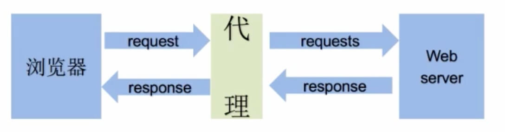

# Requests模块介绍

## Requests模块的作用

发送http请求，获取响应数据

## Requests模块是一个第三方模块

安装 `pip/pip3 install requests` 

[官方文档](https://requests.readthedocs.io/zh_CN/latest/)

## Requests模块发送get请求

```python

# 简单的代码实现
import requests

# 目标url
url = "http://www.baidu.com"

# 向目标url发送get请求
response = requests.get(url)

# 打印响应内容
print(response.text)

```

1. response.text是requests模块按照chardet模块推测出的编码字符集进行解码的结果
2. 网络传输的字符串都是bytes类型，所以response.text = response.content.decode("推测出来的编码字符集")
3. 可以在网页上搜索charset，尝试参考编码字符集，注意存在不准确的情况


## Response

### response.text和response.content的区别

- response.text
    - 类型：str
    - 解码类型：requests模块自动根据HTTP头部响应的编码作出有根据的推测，推测的文本编码
- response.content
    - 类型：bytes
    - 解码类型：没有指定

`response.encoding = "utf-8" 设置编码格式`

`response.content.decode() 如果是用content bytes类型，需要使用decode解码`

### 解决中文乱码问题

通过对response.content进行decode，来解决中文乱码问题

- `response.content.decode() 默认utf-8`
- `response.content.decode("GBK")`

常见的编码字符：
- utf-8
- gbk
- gb2312
- ascii（阿斯克码）
- iso-8859-1

### response响应对象的其他常用属性和方法

``` python

response.url # 响应的url，有时候响应的url和请求的url并不一致
response.status_code # 响应状态码
response.request.headers # 响应对应的请求头
response.headers # 响应头
response.request._cookies # 响应对应请求的cookie，返回cookieJar类型
response.cookies # 响应的cookie（经过了set-cookie动作，返回cookieJar类型）
response.json() # 自动将json字符串类型的响应内容转换为python对象

```

## Request

### 发送带header的请求

注意：浏览器开发控制器中，network下Preserve log如果勾选的话，在页面刷新的时候，请求记录不会清空

`requests.get(url, headers=headers)`
- headers参数接收字典形式的请求头
- 请求头字段名作为key，字段对应的值作为value

```python

headers = {"User-Agent":"可以在浏览器中查看"}

response = requests.get(url, headers=headers)

```

### 发送带参数的请求

注意：抓包的时候会发现链接上携带很多参数，找出重要的参数即可，一个一个参数删除，查看返回数据是否有变化，如果有变化，说明上一个删除的参数很重要

1. url直接携带参数
2. 构建请求参数字典，向接口发送请求时带上参数字典，参数字典设置给params

```python

kw = {"wd": "python"}

reponse = requests.get(url, headers, params=kw)

```

### 发送带cookie的请求

注意：cookie大多用于账户登录数据记录

卸载headers中，以字符串类型注入headers

```python

headers = {"User-Agent": "...", "Cookie": "..."}

```

### cookies参数的使用

1. cookies参数形式：字典
    1. `cookies={"cookie的name": "cookie的value"}`
2. cookies参数的使用方法
    1. 该字典对应请求头重Cookie字符串，以分号、空格分割每一对字典键值对
    2. 等号左边的是一个cookiename，对应cookie字典的key
    3. 等号右边对应cookie字典的value
    4. `response = requests.get(url, cookies)`
3. 将cookie字符串转换成cookies参数所需的字典

```python 

# temp就是请求返回的cookie
cookie_list = temp.split("; ")
cookies = {}

for cookie in cookie_list:
    cookies[cookie.split("=")[0] = cookie.split("=")[-1]

# 可以将上面式子写成
cookies_dict = {cookie.split("=")[0]:cookie.split("=")[-1] for cookie in temp.split("; ")}

print(cookies)

```

注意：cookie一般是有过期时间，一旦过期需要重新获取

### cookieJar对象转换为cookies字典方法

` cookies_dict = requests.utils.dict_from_cookiejar(response.cookie) `

其中response.cookies返回的就是cookieJar类型的对象

` requests.utils.dict_from_cookiejar ` 函数返回cookies字典

### 超时参数timeout的使用

超时参数timeout使用方法
`response = requests.get(url, timeout=3)`

timeout=3表示：发送请求3秒内没有返回响应，否则就抛出异常

### 代理

代理ip是一个ip，指向的是一个代理服务器
代理服务器能够帮我们向目标服务器转发请求



正向代理和反向代理的区别：
1. 从发送请求的一方的角度，来区分正向或反向代理
2. 为浏览器或客户端转发请求的，叫做正向代理
    - 浏览器知道最终处理请求的服务器的真实ip地址，例如VPN
3. 不为浏览器或客户端转发请求、而是为最终处理请求的服务器转发请求的，叫反向代理
    - 浏览器不知道服务器的真实地址，例如nginx

代理ip分类：
- 透明代理：透明代理虽然可以直接“隐藏”你的ip，但还是可以查到你是谁，目标服务器接收到的请求头如下

```python
REMOTE_ADDR = Proxy IP
HTTP_VIA = Proxy IP
HTTP_X_FORWARDED_FOR = Your IP
```

- 匿名代理：别人只能知道你用了代理，无法知道你是谁。目标服务器接收到的请求头如下

```python
REMOTE_ADDR = proxy IP
HTTP_VIA = proxy IP
HTTP_X_FORWARDED_FOR = proxy IP
```

- 高匿代理：让别人根本无法发现你是在用代理，所以是最好的选择。毫无疑问使用这个代理效果好。目标服务器接收到的请求头如下

```python
REMOTE_ADDR = Proxy IP
HTTP_VIA = not determined
HTTP_X_FORWARDED_FOR = not determined
```

根据网站所使用的协议不同，需要使用相应协议代理服务：
- http代理
- https代理
- socks隧道代理
    - socks 代理只是简单地传递数据包，不关系是何种应用协议
    - socks 代理比http、https代理耗时少
    - socks 代理可以转发http和https的请求


### proxies代理参数使用

[查找代理IP1](https://www.kuaidaili.com/free/)
[查找代理IP2](https://proxy.mimvp.com/free.php)
注意：如果使用免费代理ip，最好是对这些代理IP网站进行爬取筛选

```python

proxies = {
    "http": "http://12.34.56.78:9527",
    "https": "http://12.34.56.78:9527"
}

response = requests.get(url, proxies=proxies)

```

代理使用成功不会有任何报错，能成功获取响应，如果失败，要么卡滞，要么报错

### 使用verify参数忽略CA证书

请求链接的时候会提示不安全链接，需要点继续访问才可以。

```python
response = requests.get(url, verify=False)
```

### POST请求

参数data，数据类型为字典，repsponse模块发送post请求函数的其他参数和发送get请求的参数完全一致

`word = input("请输入") 运行终端输入信息`
`word = sys.argv[1] 命令行启动后面跟参数` 

### POST请求数据来源

1. 固定值 抓包比较不变值
2. 输入值 抓包比较根据自身变化值
3. 预设值-静态文件 需要从html中获取
4. 预设值-发请求 需要对指定地址发送请求
5. 在客户端生成 分析js，模拟生成数据


### requests.session的作用及应用场景

requests.session 自动处理cookie，即下一次请求会带上前一次的cookie

应用场景：自动处理连续的多次请求过程中产生的cookie

```python
session = requests.session()
response = session.get(url, headers, ...)
response = session.post(url, headers, ...)
```