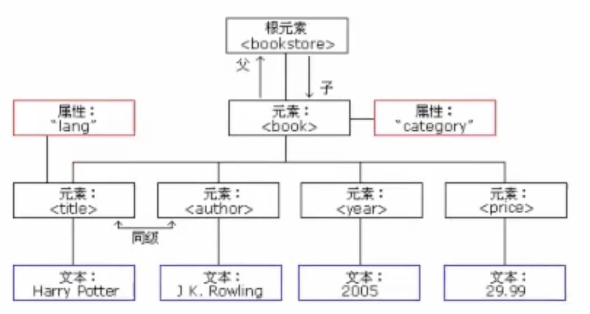
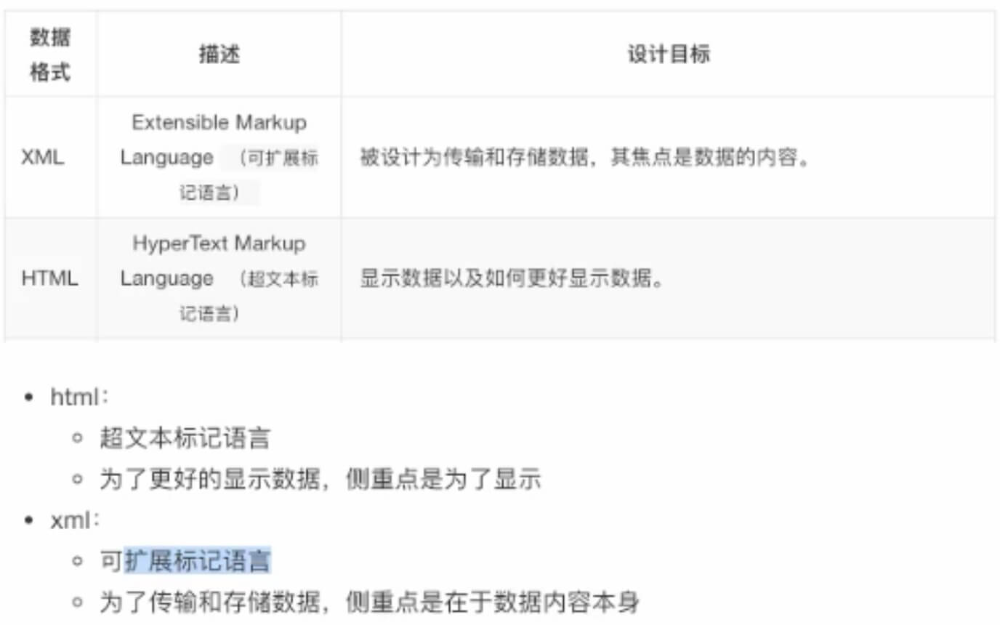
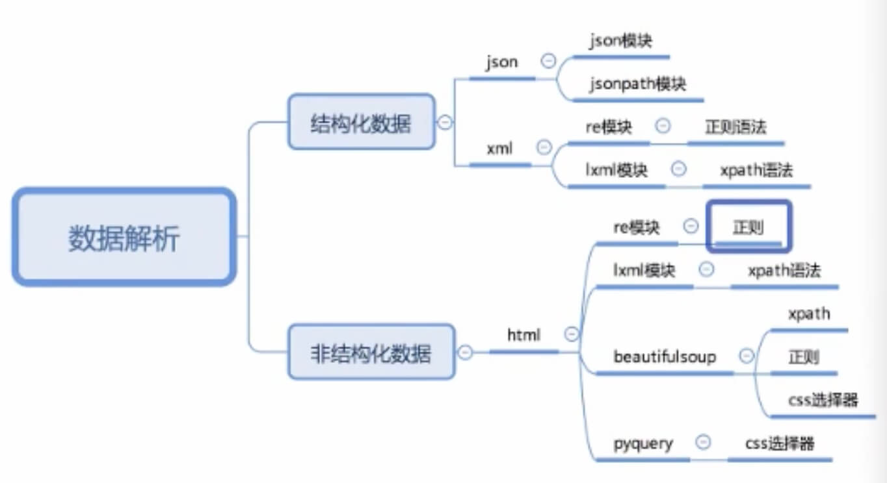
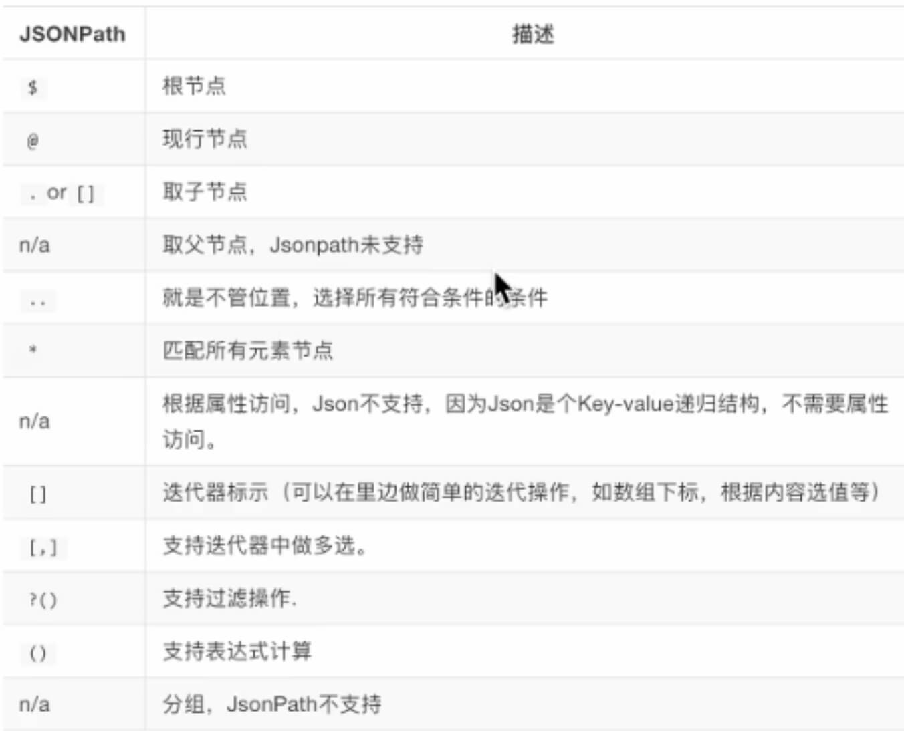
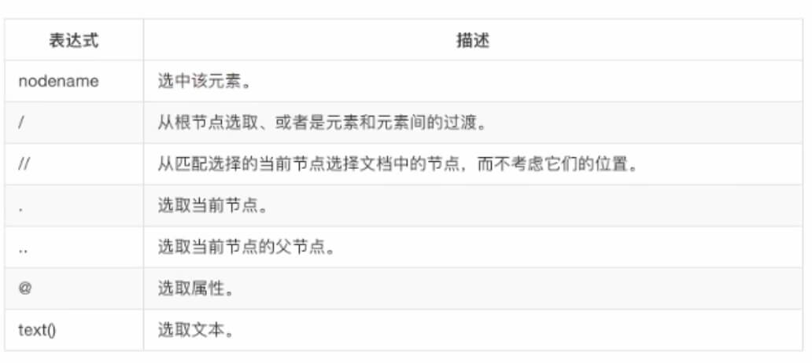
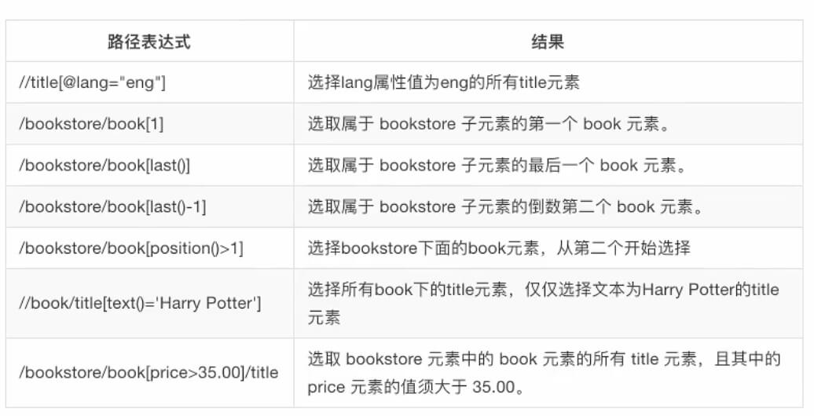

# 响应内容分类

- 结构化的响应内容
    - json字符串（高频出现）
        - json模块
        - re模块 正在表达式
        - jsonpath
    - xml字符串（低频出现）
        - re模块
        - lxml模块 
- 非结构化的响应内容
    - html字符串
        - re模块
        - lxml模块

浏览器控制台network
- XHR：ajax请求
- Doc：html文件
- 按住command多选
- 建议：查找中文最好在Preview中查找

# 认识xml以及和html的区别

xml是一种可扩展标记语言，样子和html很像，功能更专注于对传输和存储数据



### 区别



# 常用数据解析方法




# jsonpath模块

jsonpath可以按照key对python字典进行批量数据提取

### 使用方法

安装 `pip install jsonpath`



常用$、.、..

jsonpath的结果为列表，获取数据需要索引

```python

import jsonpath

jsonpath({data: {name: {color: {}}}}, '$..color')

```

# lxml和xpath

- lxml可以用xpath规则语法，来快速定位html、xml文档中特定元素以及获取节点信息
- xpath是一门在html、xml文档中查找信息的语言，可用来对元素和属性进行遍历

### xpath

谷歌浏览器安装xpath helper插件安装






通过属性值修饰节点
`div[@id="content-left"]/div/@id`

通过自节点的值修饰节点
`span[i>2000]`
`div[span[2]>=9.4]`

通过包含修饰
`div[contains(@id,"qiushi_tag_")]`
`span[contains(text(), "一页")]`

通配符
`* 匹配任何元素节点`
`@* 匹配任何属性节点`
`node() 匹配任何类型的节点`

`//* 全部标签`
`//@* 全部属性`

### lxml

```python

from lxml import etree

html = etree.HTML(text)

ret_list = html.xpath("xpath语法规则字符串")

# 以相同的索引分别遍历两个列表
for text,link in zip(text_list, link_list):
    print(text, link)

```
