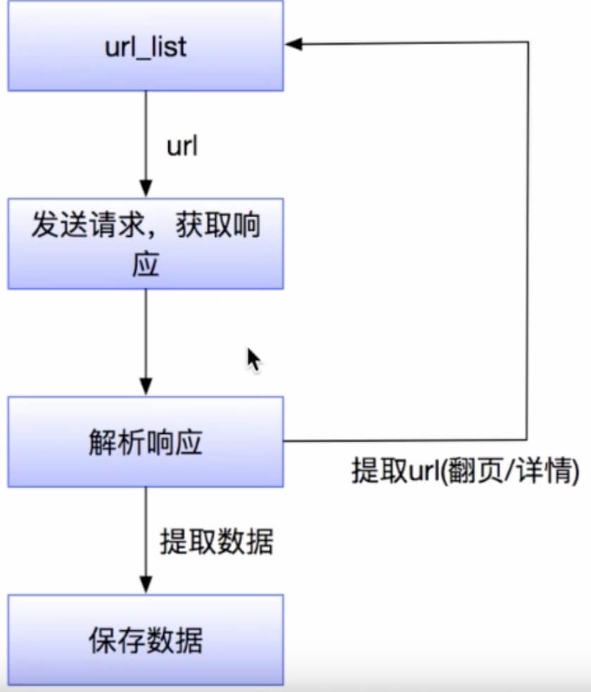
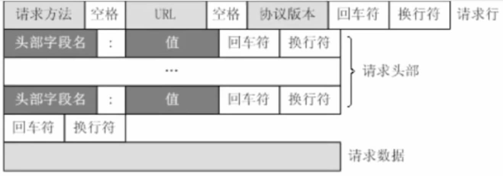
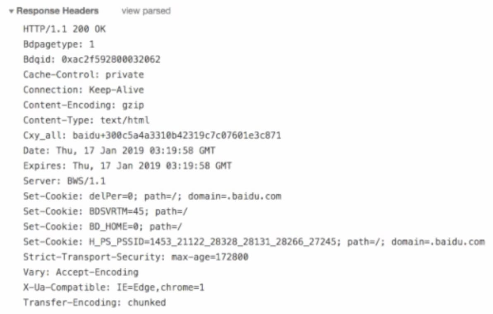
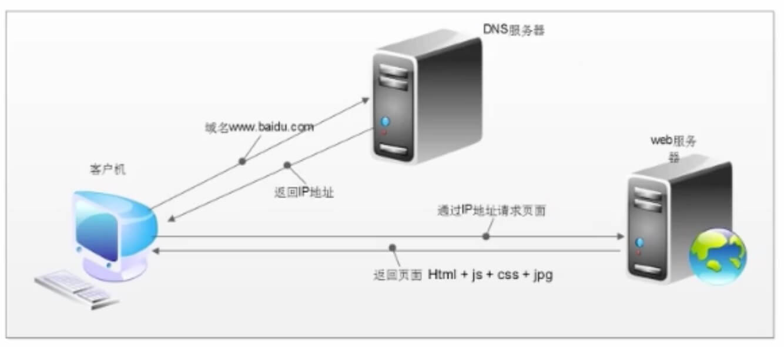

# 爬虫概述
模拟浏览器，发送请求，获取响应
网络爬虫（又被称为网页蜘蛛，网络机器人）就是模拟客户端（主要指浏览器）发送网络请求，接收请求响应，一种按照一定的规划，自动地抓取互联网信息的程序。
- 原则上，只要是客户端（浏览器）能做的事情，爬虫都能够做
- 爬虫也只能获取客户端（浏览器）所展示出来的数据

# 爬虫的作用
1. 数据采集
    1. 抓取微博评论（机器学习舆情监控）
    2. 抓取招聘网站的招聘信息（数据分析、挖掘）
    3. 新浪滚动新闻
    4. 百度新闻网站
2. 软件测试
    1. 爬虫之自动化测试
    2. 虫师
3. 12306抢票
4. 网站上投票
    1. 投票网
5. 网络安全
    1. 短信轰炸
        1. 注册页面1
        2. 注册页面2
        3. 注册页面3
    2. web漏洞扫描

    
# 爬虫的分类

## 根据被爬取网站的数量不同，可以分为：
- 通用爬虫，如 搜索引擎
- 聚焦爬虫，如 12306抢票，或专门抓去某一个（某一类）网站数据

## 根据是否以获取数据为目的，可以分为：
- 功能性爬虫，给你喜欢的明星投票、点赞
- 数据增量爬虫，比如招聘信息

## 根据url地址和对应的页面内容是否改变，数量增加爬虫可以分为：
- 基于url地址变化、内容也随之变化的数据增量爬虫
- url地址不变、内容变化的数据增量爬虫

# 爬虫的流程

1. 获取一个url
2. 向url发送请求，并获取响应（需要http协议）
3. 如果从响应中提取url，则继续发送请求获取响应
4. 如果从响应中提取数据，则将数据进行保存

# http协议

## http以及https的概念和默认端口

发送请求，获取响应需要用到http/https协议

- HTTP：超文本传输协议，默认端口是80
    - 超文本：是指超过文本，不仅限于文本，还包括图片、音频、视频等文件
    - 传输协议：是指使用共用约定的固定格式来传递转换成字符串的超文本内容
- HTTPS：HTTP+SSL（安全套接字层），即带有安全套接字层的超文本传输协议，默认端口号：443
    - SSL对传输的内容（超文本，也就是请求或响应体）进行加密
- 可以打开浏览器访问一个url，右键检查，点击network，点选一个url，查看http协议的形成

## 爬虫关注的请求头和响应头

- Content-Type
- Host（主机和端口号）
- Connection（链接类型）
- Upgrade-Insecure-Requests（升级为https请求）
- User-Agent（用户代理，提供系统信息和浏览器信息）
- Referer（页面跳转处，防盗链：图片/视频）
- Cookie（Cookie）
- Authorization（用于表示http协议中需要认证资源的认证信息）

- Set-Cookie（对方服务器设置cookie到用户浏览器的缓存）

## 常见的响应状态码

- 200：成功
- 302：跳转，新的url在响应的Location头中给出
- 303：浏览器对于POST的响应进行重定向至新的url
- 307：浏览器对于GET的响应重定向至新的url
- 403：资源不可用；服务器理解客户的请求，但拒绝处理它（没有权限）
- 404：找不到该页面
- 500：服务器内部报错
- 503：服务器由于维护或者负载过重未能应答，在响应中可能会携带Retry-After响应头；有可能是因为爬虫频繁访问URL，使服务器忽视爬虫的请求，最终放回503响应状态码

所有的状态码都不可信，一切以是否从抓包得到的响应中获取到数据为准

## 浏览器和爬虫爬取的区别

### http请求的过程

1. 浏览器在拿到域名对应的ip后，先向地址栏中的url发起请求，并获取响应
2. 在返回的响应内容html中，会带有css，js，图片等url地址，以及ajax代码，浏览器按照响应内容中的顺序依次发送其他的请求，并获取相应的响应
3. 浏览器没获取一个响应就对展示出的结果进行添加（过载），js，css等内容会修改页面的内容，js也可以重新发送请求，获取响应
4. 从获取第一个响应并在浏览器中展示，直到最终获取全部响应，并在展示的结果中添加内容或修改--这个过程就做浏览器的渲染

### 注意

爬虫只会请求url地址，对应的拿到url地址对应的响应（该响应的内容可以是html，css，js，图片等）

- 浏览器最终展示的结果是由多个url地址分别发送的多次请求对应的多次响应共同渲染的结果
- 在爬虫中，需要以发送请求的一个url地址对应的响应为准来进行数据的提取