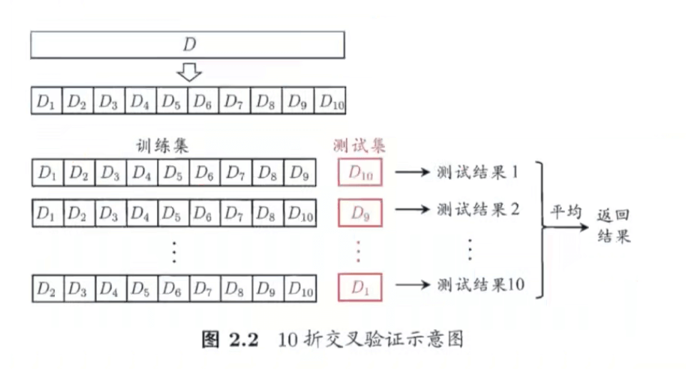
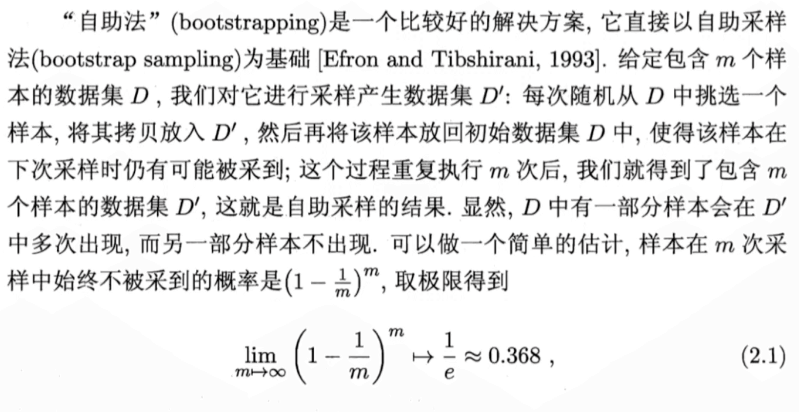
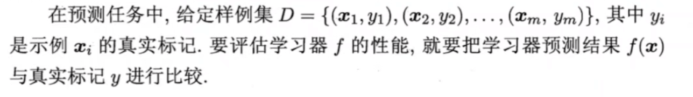
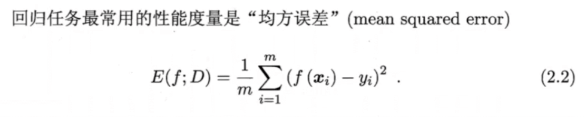
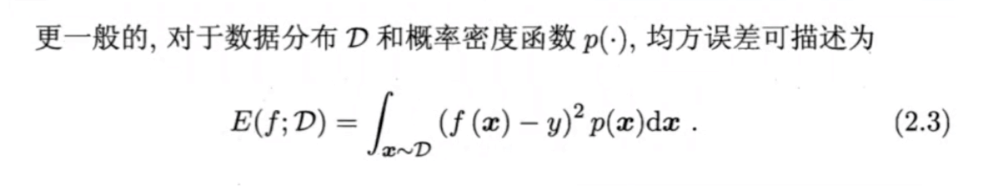
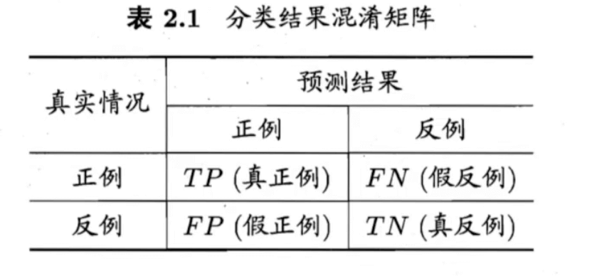

# 02 模型评估和选择

## 2.1 经验误差与过拟合【简述】

一些概念明确，以手写字体识别为例子，m样本数量，比如有10000张手写字体的图片，Y样本正确的结果，比如第一张图片是1，第二张图片是7。使用模型进行预测，对一万张图片给出判断，预测的结果是 $Y^`$ 。其中a个错了，则error rate错误率：$E = a/m$ ，accuracy精度：$1-E$ ，error误差：$|Y-Y^`|$

## 2.2 评估方法 【训练集验证集与测试集】

### 泛化能力

即模型对没有结果的数据的预测能力

训练集vs测试集

### training set 训练集

### testing set 测试集的保留方法

#### 1.留出法

很简单的三七分，二八分。但是要注意训练集与测试集同分布，或者进行多次随机划分，训练出多个模型，最后取平均值。

#### 2.交叉验证法

K折交叉验证

缺点：数据量较大时，对算力要求较高

#### 3.自助法

原理：此方法仅做了解

适用：

* 数据集较小，难以划分的时候
* 缺点是改变初始数据集分布，会引入估计偏差

### validation set 验证集

调参很难，很多参数是人为规定的

比如三个参数，每个参数5个候选值，对于一个训练集/测试集就有$5^3=125$个模型需要考察

为了调参，经常会加一个数据集，验证集

训练集训练，验证集看结果，调参，再看验证集结果，参数调完，最后再测试集上看结果

## 2.3 性能度量 【具体公式】

Performance management性能度量

mean squared error均方误差

### 2.3.1错误率与精度

error rate 错误率：$$E(f;D)=\frac{1}{m}\sum_{i=1}^{m}I(f(x_i)\ne y_i)$$

其中I是统计，满足括号里的条件的元素的个数的意思（指示函数，为真和假时分别取值为1，0）

accuracy精度：$$acc(f;D)=\frac{1}{m}\sum_{i=1}^{m}I(f(x_i)= y_i)=1-E(f;D)$$

### 2.3.2查准率、查全率与F1 

Confusion matrix 混淆矩阵

True positive

False positive

True negative

False negative

查准率P-percision：$$P=\frac{TP}{TP+FP}$$

查全率R-recall：$$R=\frac{TP}{TP+FN}$$

P-R反向关系变动示意图